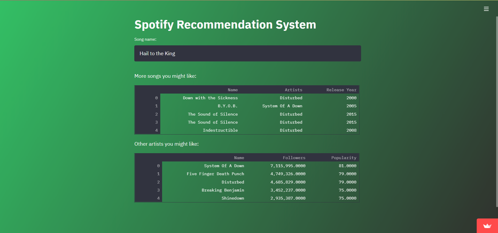

# Spotify-CBRS
This is a Content-based Recommendation System (CBRS) for Spotify developed using [Spotify dataset](https://www.kaggle.com/yamaerenay/spotify-dataset-19212020-160k-tracks) available on Kaggle. The project is carried out in 2 parts - Data Transformation (Part 1) and EDA & Modelling (Part 2).

In the first part of the project, the existing Spotify dataset is transformed into a form that is more usable for modelling and developing the recommendation system. Part 2 involves Exploratory Data Analysis of this data and development of the CBRS.

# Streamlit App
The recommendation system is deployed using Strealit. Check it out [here](https://share.streamlit.io/prathamsharma25/spotify-cbrs/main/App/app.py).

---

Pratham Sharma

Student at Vellore Institute of Technology, Vellore, Tamil Nadu, India

Reach out to me: prathams2425@gmail.com

LinkedIn profile: https://www.linkedin.com/in/prathamSharma25/

Kaggle profile: https://www.kaggle.com/prathamsharma123
